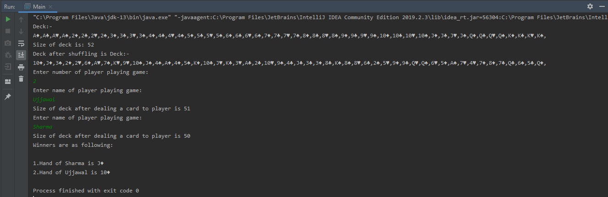

# Deck Game

Design a data structure that represents the generic deck of cards (52-cards, 4-suits, 13-cards/suit).Such a deck should support:

- Shuffling of cards present in the deck.
- Get one or more cards from the deck.
- Return one or more cards to the deck.
- Print the cards present in the deck.

Using the deck designed above, create a game that can be played by two or more players and a single deck. 
Game rules are the following:
- The game starts with each player getting one card from the deck.
- The winner is decided based on the value of the card that he/she is holding. If players have the same value cards, the winner should be decided based on this priority: SPADES>HEART>CLUB>DIAMONDS

## Screenshots


## Requirements

- Java Version 8 or higher.

## Installation

- Press the Fork button (top right the page) to save a copy of this project on your account.

- Download the repository files (project) from the download section or clone this project by typing in the bash the following command:

```git
git clone https://github.com/HouariZegai/Calculator.git
```
- Imported it in Intellij IDEA or any other Java IDE.

- Run the application.

> Happy Coding


